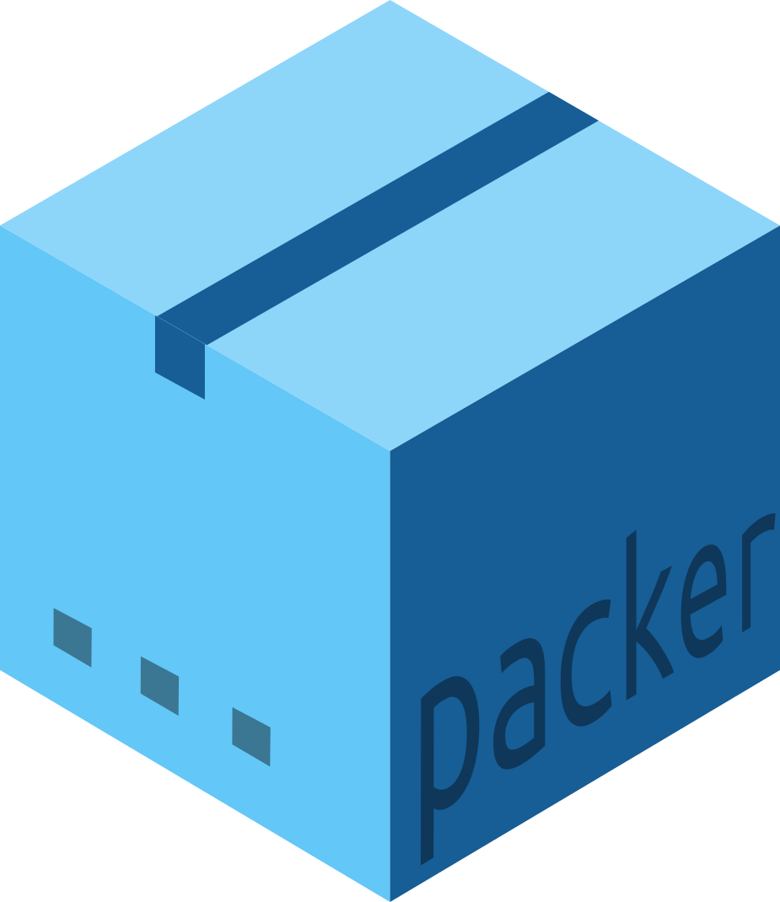

<div align="center">



<!-- badges: start -->
[](https://travis-ci.com/JohnCoene/packer)
[](https://coveralls.io/github/JohnCoene/packer)


<!-- badges: end -->

[Website](https://packer.john-coene.com/) | [Installation](https://packer.john-coene.com/#/guide/installation) | [Get Started](https://packer.john-coene.com/#/guide/getting-started)

## An opinionated framework for using JavaScript with R

</div>

At its core packer consists of functions to scaffold R packages powered by webpack and npm, these take the form of scaffolds which are built on top of packages. All of the scaffolds below thus need to be run from within an R package.

### Things you can do with packer

- Use npm packages with htmlwidgets
- Create your shiny UI with the pug templating engine
- Include React in you shiny application
- Bundle JavaScript files for golem
- Use Vue in a shiny app
- And so much more...

### Usage

Always start from an empty package and run `scaffold_*` to set up the required basic structure.

```r
packer::scaffold_input("increment")
```

Once the scaffold laid down you can either `bundle` the JavaScript or `watch` for changes as you develop it.

```r
packer::bundle()
```

You can then document and install the package to try it out.
