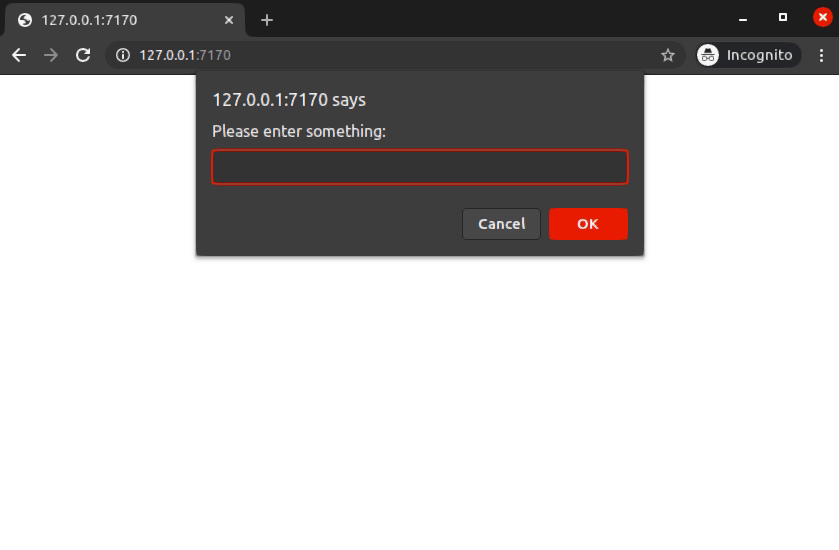

# Scaffolds

## Golem

The `scaffold_golem` function will lay down the scaffolding for a golem package.

```r
golem::create_golem("stocks") # create golem
packer::scaffold_golem()
```

```
── Scaffolding golem ──────────────────────────────────────────────────── 

✔ Initialiased npm
✔ webpack, webpack-cli installed
✔ Added npm scripts
✔ Created `srcjs` directory
✔ Created webpack config file

── Adding files to .gitignore and .Rbuildignore ──

✔ Setting active project to '/Packages/stocks'
✔ Adding '^srcjs$' to '.Rbuildignore'
✔ Adding '^node_modules$' to '.Rbuildignore'
✔ Adding '^package\\.json$' to '.Rbuildignore'
✔ Adding '^package-lock\\.json$' to '.Rbuildignore'
✔ Adding '^webpack\\.config\\.js$' to '.Rbuildignore'
✔ Adding 'node_modules' to '.gitignore'

── Scaffold built ──

ℹ Run `bundle` to build the JavaScript files
```

This will let you use packer to bundle files to `inst/app/www`.

<Danger title="Unique" text="The scaffold for golem is unique in that only one can be laid down." />

## Widgets

Htmlwidgets can also be scaffolded with `scaffold_widget`. Note that is will internally run `htmlwidgets::scaffoldWidget`.

```r
usethis::create_package("plotly")
packer::scaffold_widget("write_h1")
```

```
── Scaffolding widget ───────────────────────────────────────── write_h1 ── 

✔ Bare widget setup
✔ Created `srcjs` directory
✔ Initialiased npm
✔ webpack, webpack-cli installed
✔ Created webpack config file
✔ Created `srcjs/modules` directory
✔ Created `srcjs/widgets` directory
✔ Created `srcjs/index.js`
✔ Moved bare widget to `srcjs`
✔ Added npm scripts

── Adding files to .gitignore and .Rbuildignore ──

✔ Setting active project to '/Packages/plotly'
✔ Adding '^srcjs$' to '.Rbuildignore'
✔ Adding '^node_modules$' to '.Rbuildignore'
✔ Adding '^package\\.json$' to '.Rbuildignore'
✔ Adding '^package-lock\\.json$' to '.Rbuildignore'
✔ Adding '^webpack\\.config\\.js$' to '.Rbuildignore'
✔ Adding 'node_modules' to '.gitignore'

── Adding packages to Imports ──

✔ Adding 'htmlwidgets' to Imports field in DESCRIPTION
● Refer to functions with `htmlwidgets::fun()`

── Scaffold built ──

ℹ Run `bundle` to build the JavaScript files
```

This produces a toy widget which renders a message in HTML `h1` tags.

```r
packer::bundle()
devtools::document()
devtools::load_all()
write_h1("hello packer!")
```


<Danger title="Warning" text="Do not run scaffold the widget with the htmlwidgets package" />

## Extensions

In packer, a shiny extension is a package that extends much the way shinyjs or waiter does. Note that multiple extensions can be scaffolded within a single R package.

```r
usethis::create_package("alerts")
packer::scaffold_extension("ask")
```

```
── Scaffolding shiny extension ─────────────────────────────────────── ask ── 

✔ Initialiased npm
✔ Created `srcjs/exts` directory
✔ Created `inst/packer` directory
✔ webpack, webpack-cli installed
✔ Added npm scripts
✔ Created webpack config file
✔ Created `srcjs/index.js` file
✔ Created input module directory
✔ Created JavaScript extension file
✔ Added path shiny resource
✔ Created R functions

── Adding files to .gitignore and .Rbuildignore ──

✔ Setting active project to '/Packages/alerts'
✔ Adding '^srcjs$' to '.Rbuildignore'
✔ Adding '^node_modules$' to '.Rbuildignore'
✔ Adding '^package\\.json$' to '.Rbuildignore'
✔ Adding '^package-lock\\.json$' to '.Rbuildignore'
✔ Adding '^webpack\\.config\\.js$' to '.Rbuildignore'
✔ Adding 'node_modules' to '.gitignore'

── Adding packages to Imports ──

✔ Adding 'shiny' to Imports field in DESCRIPTION
● Refer to functions with `shiny::fun()`

── Scaffold built ──

ℹ Run `bundle` to build the JavaScript files
```

This builds a toy extension that uses vanilla JavaScript's `prompt` function to ask the user a question then relays the answer back to the server.

```r
packer::bundle()
devtools::document()
devtools::install()
```

```r
library(alerts)
library(shiny)

ui <- fluidPage(
  useAsk(),
  verbatimTextOutput("response")
)

server <- function(input, output){
ask("Please enter something:")
 output$response <- renderPrint({
   input$askResponse
 })
}

if(interactive())
 shinyApp(ui, server)
```



## Inputs

You can also use packer to scaffold custom shiny inputs.

```r
usethis::create_package("inputz")
packer::scaffold_extension("increment")
```

```
── Scaffolding shiny input ───────────────────────────────────increment ── 

✔ Initialiased npm
✔ Created `srcjs` directory
✔ Created `inst/packer` directory
✔ webpack, webpack-cli installed
✔ Created webpack config file
✔ Created `srcjs/inputs` directory
✔ Created input file in `srcjs/inputs`
✔ Created input module and `index.js` file
✔ Created R file and function
✔ Added npm scripts

── Adding files to .gitignore and .Rbuildignore ──

✔ Setting active project to '/Packages/inputz'
✔ Adding '^srcjs$' to '.Rbuildignore'
✔ Adding '^node_modules$' to '.Rbuildignore'
✔ Adding '^package\\.json$' to '.Rbuildignore'
✔ Adding '^package-lock\\.json$' to '.Rbuildignore'
✔ Adding '^webpack\\.config\\.js$' to '.Rbuildignore'
✔ Adding 'node_modules' to '.gitignore'

── Adding packages to Imports ──

✔ Adding 'shiny' to Imports field in DESCRIPTION
● Refer to functions with `shiny::fun()`
✔ Adding 'htmltools' to Imports field in DESCRIPTION
● Refer to functions with `htmltools::fun()`

── Scaffold built ──

ℹ Run `bundle` to build the JavaScript files
```

The toy example scaffolded by packer is a but that increments at every click.

```r
packer::bundle()
devtools::document()
devtools::install()
```

```r
library(inputz)
library(shiny)

ui <- fluidPage(
 incrementInput("theId", 0)
)

server <- function(input, output){

 observeEvent(input$theId, {
   print(input$theId)
 })

}

if(interactive())
 shinyApp(ui, server)
```


## Outputs

You can also scaffold a custom output for shiny.

```r
usethis::create_package("outputz")
packer::scaffold_output("markup")
```

```
── Scaffolding shiny output ─────────────────────────────────────── markup ── 
✔ Initialiased npm
✔ Created `srcjs/outputs` directory
✔ Created `inst/packer` directory
✔ webpack, webpack-cli, webpack-merge installed with scope dev
✔ Added npm scripts
✔ Created `srcjs/config` directory
✔ Created webpack config files
✔ Created `srcjs/index.js` file
✔ Created input module directory
✔ Created R file and function

── Adding files to .gitignore and .Rbuildignore ──

✔ Setting active project to '/home/jp/Projects/outputz'
✔ Adding '^srcjs$' to '.Rbuildignore'
✔ Adding '^node_modules$' to '.Rbuildignore'
✔ Adding '^package\\.json$' to '.Rbuildignore'
✔ Adding '^package-lock\\.json$' to '.Rbuildignore'
✔ Adding '^webpack\\.dev\\.js$' to '.Rbuildignore'
✔ Adding '^webpack\\.prod\\.js$' to '.Rbuildignore'
✔ Adding '^webpack\\.common\\.js$' to '.Rbuildignore'
✔ Adding 'node_modules' to '.gitignore'

── Adding packages to Imports ──

✔ Adding 'shiny' to Imports field in DESCRIPTION
● Refer to functions with `shiny::fun()`
✔ Adding 'htmltools' to Imports field in DESCRIPTION
● Refer to functions with `htmltools::fun()`

── Scaffold built ──

ℹ Run `bundle` to build the JavaScript files
```

Like other scaffolds the R code generated contains a toy example.

```r
library(shiny)

ui <- fluidPage(
 markupOutput("id")
)

server <- function(input, output){
 output$id <- renderMarkup({
   markup(h2("Hello"))
 })
}

if(interactive())
 shinyApp(ui, server)
```


