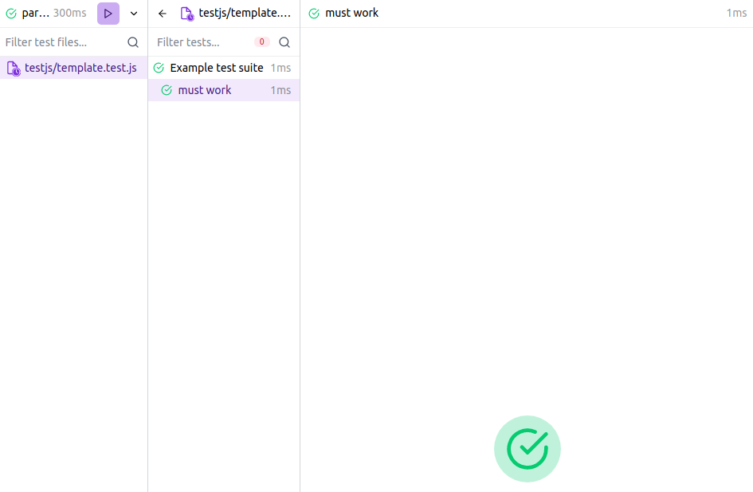

# Unit Tests

Just like one can run unit tests for R code using [testthat](https://testthat.r-lib.org/), one can also test JavaScript code. Currently packer supports [mocha.js](https://mochajs.org/).

```r
# create a package and a scaffold
usethis::create_package("display")
packer::scaffold_output("display")
```

With a package and scaffold one can add tests with
one of two frameworks, [mocha](https://mochajs.org/),
and [peeky](https://github.com/Akryum/peeky).

Both frameworks are similar but __exclusive,__ use
one or the other. The main difference between the
two is that peeky provides an UI report to visualise
the tests. It's however relatively new, mocha is mature
and well tested.

## Mocha

First, setup initial support for tests using mocha.

```r
packer::include_tests_mocha()
```

```
✔ Created `testjs` directory
✔ mocha installed with scope dev
✔ mocha-loader installed with scope dev
✔ Added loader rule for mocha-loader

── Ignoring files ──

✔ Adding '^testjs$' to '.Rbuildignore'
✔ Adding 'testjs' to '.gitignore'
✔ Added npm test script
```

This creates a new `testjs` directory in which one can place tests; all the names of files containing tests should end with `.test.js`, e.g.: `name.test.js`. The function places a `template.test.js` file containing the following tests (one that should pass and another fail).

```js
// test.js
describe('Test', () => {
  it('should succeed', (done) => {
    setTimeout(done, 1000);
  });

  it('should fail', () => {
    if (require('./module')) {
      throw new Error('Failed');
    }
  });
});
```

Then run the tests.

```r
packer::run_tests()
```

```
Test
  ✓ should succeed (1004ms)
  1) should fail


1 passing (1s)
1 failing
```

## Peeky

First, setup initial support for tests using peeky.

```r
packer::include_tests_peeky()
```

```
✔ Created testjs directory
✔ @peeky/cli installed with scope "dev"

── Ignoring files ──

✔ Adding '^testjs$' to '.Rbuildignore'
✔ Adding 'testjs' to '.gitignore'
✔ Added npm test script
ℹ Use `run_tests` to run the tests
```

This creates a template test file in `testjs/`.

```js
describe('Example test suite', () => {
  test('must work', () => {
    expect(42).toBe(42)
  })
})
```

Once done, tests can be run with `run_tests`, setting `open` 
to `TRUE` opens the UI. 

```r
run_tests(open = TRUE)
```



You can add tests by creating a file yourself or 
use `packer::add_test_file()`
